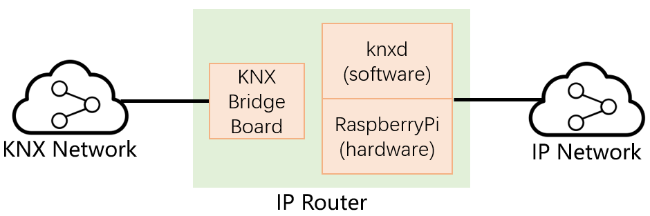
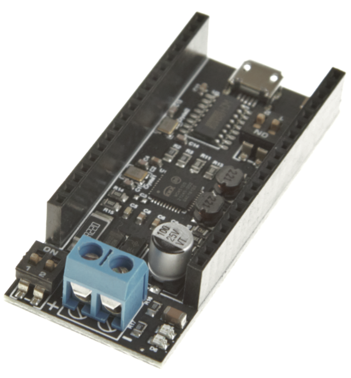

# KNX IP Router DIY

## Summary

IP Router is a KNX equipment connecting KNX network and IP network, to help IP devices receive and send signals on the KNX bus.


However, some kinds of IP Routers can only connect to IP network via RJ45 connector, without the capability of WIFI, which will cause inconvenience in some environment. Moreover, IP Router is always expensive.

This project aims building a **convenient, stable, and cheap** IP Router, by using open source software and simple hardware.

## Architecture



We choose [Raspberry Pi](https://www.raspberrypi.org/) as the main hardware, and run the open source [`knxd`](https://github.com/knxd/knxd) on it.

Raspberry Pi can connect to IP network easily, but on which, there is no interface connected to KNX bus directly. Therefore, we need to make a hardware(KNX Bridge Board), which could connect to KNX bus on one hand, and connect to Raspberry Pi on the other, so that `knxd` on Raspberry Pi can send and receive data in KNX network.

## KNX Bridge Board



The KNX Bridge Board is based on [ncn5120 chip](https://www.onsemi.com/pdf/datasheet/ncn5120-d.pdf), which can communicate with KNX bus.

On the other hand, the KNX Bridge Board shall communicate with `knxd` running on Raspberry Pi. Three connection modes are supported, you could choose one of them.

1. Plugging into Raspberry PI's board
 
    As a shield, KNX Bridge Board could be plugged into the 40-pin connector on raspberry pi(ZeroW/3B/3B+/4B) mainboard directly. 

    HAChina KNX Bridge Board **type B** supports this connection mode.

2. Connecting via USB

    KNX Bridge Board has a mini USB interface, which could be connected to USB on raspberry pi.

    HAChina KNX Bridge Board **type A** supports this connection mode.

3. Communicating via WIFI

    As a sheild of [NodeMCU-32s](https://docs.ai-thinker.com/en/esp32/boards/nodemcu_32s), KNX Bridge Board can plug into the 38-pin connector on [NodeMCU-32s](https://docs.ai-thinker.com/en/esp32/boards/nodemcu_32s). [Setup NodeMCU-32s](esp32.md), then it can communicate with `knxd` via Wifi.

*[Where can I buy a KNX Bridge Board?](FAQ.md#where-can-i-buy-a-knx-bridge-board)*

*[What's the difference between KNX Bridge Board type A and type B?](FAQ.md#whats-the-difference-between-knx-bridge-board-type-a-and-type-b)*

*[Can I make a KNX Bridge Board myself?](FAQ.md#can-i-make-a-knx-bridge-board-myself)*

## Run `knxd`

Raspberry PI ZeroW/3B/3B+/4B are tested and recommended.

*[Must knxd runs on raspberry pi?](FAQ.md#must-knxd-runs-on-raspberry-pi)*

#### Run in docker


- Install docker
    + OS： `Pi OS`
    + install docker

        `curl -fsSL get.docker.com | sudo sh`

    + add user `pi`(or any user you login as) into group `docker`

        `sudo usermod -aG docker pi`

- Create configuration file `/etc/knxd.ini`

    `knxd.ini` is the configuration file of knxd. You can find [knxd.ini's manual](https://github.com/knxd/knxd/blob/main/doc/inifile.rst) from its github website.

    ```ini
    # an example of knxd.ini
    [main]
    addr = 0.0.1
    client-addrs = 0.0.2:10
    connections = server,A.tcp,interface
    logfile = /dev/stdout

    [A.tcp]
    server = knxd_tcp

    [server]
    server = ets_router
    tunnel = tunnel
    router = router
    discover = true
    name = knxd

    [interface]
    driver = ncn5120

    # USB link to KNX Board
    device = /dev/ttyUSB0
    baudrate = 19200

    # 40-pin link to KNX Board
    #device = /dev/ttyAMA0
    #baudrate = 19200

    # TCP link to KNX Board
    #ip-address = 192.168.1.3
    #dest-port = 5120
    ```

    *Remove corresponding comment symbols in `[interface]` section, according to different connection methods of KNX Bridge Board.*

- Run docker image `zhujisheng/armv7-addon-knxd`

    ```
    docker run --rm -d \
    --name knxd --network="host" \
    --tmpfs /etc/cont-init.d \
    --device=/dev/ttyUSB0 \
    -v "/etc/knxd.ini:/etc/knxd.ini:ro \
    zhujisheng/armv7-addon-knxd 
    ```

    *Set parameter `--device=/dev/ttyAMA0` when KNX Bridge Board is plugging into Raspberry PI's mainboard. Remove parameter `--device` when KNX Bridge Board is communicating via WIFI.*
    

*[If my computer is not armv7, where can I get the docker image?](FAQ.md#if-my-computer-is-not-armv7-where-can-i-get-the-docker-image)*

*[Must knxd runs as a docker container or HomeAssistant add-on?](FAQ.md#must-knxd-runs-as-a-docker-container-or-homeassistant-add-on)*

#### Run as HomeAssistant add-on


- Install

    Add the add-on repository `https://github.com/da-anda/hass-io-addons` or `https://github.com/zhujisheng/hass-io-addons`

    Install `add-on:KNXD daemon` in the repository.

    *[What's the different between knxd add-ons in `da-anda` and `zhujisheng`'s add-on repository?](FAQ.md#whats-the-different-between-knxd-add-ons-in-da-anda-and-zhujishengs-add-on-repository)*

- Configuration

    ```yaml
    address: 0.0.1
    client_address: '0.0.2:8'
    interface: ncn5120
    device: /dev/ttyAMA0
    log_error_level: warning
    usb_filters: single
    custom_config: |-
      [main]
      addr = 0.0.1
      client-addrs = 0.0.2:10
      connections = server,A.tcp,interface
      logfile = /dev/stdout

      [A.tcp]
      server = knxd_tcp

      [server]
      server = ets_router
      tunnel = tunnel
      router = router
      discover = true
      name = knxd

      [interface]
      driver = ncn5120

      # USB link to KNX Board
      device = /dev/ttyUSB0
      baudrate = 19200

      # 40-pin link to KNX Board
      #device = /dev/ttyAMA0
      #baudrate = 19200

      # TCP link to KNX Board
      #ip-address = 192.168.1.3
      #dest-port = 5120
    ```

    *The valid part of the configuration is under `custom_config`. However, the rest configurations have to be retained, although they have not any effect at all, because they are set as mandatory items in this add-on.*

   *Remove corresponding comment symbols in `[interface]` section, according to different connection methods of KNX Bridge Board.*

    *[How can I config KNX devices in homeassistant?](FAQ.md#how-can-i-config-knx-devices-in-homeassistant)*