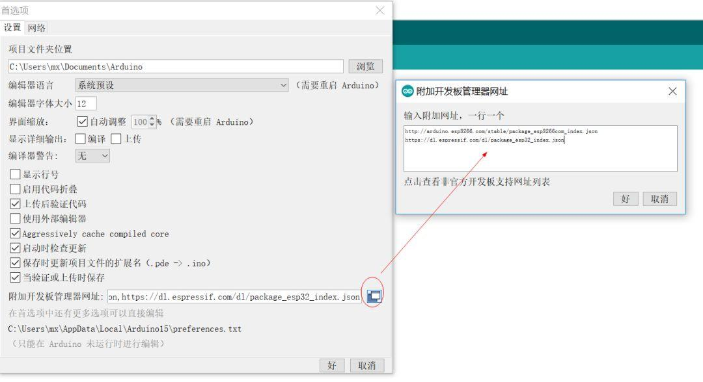
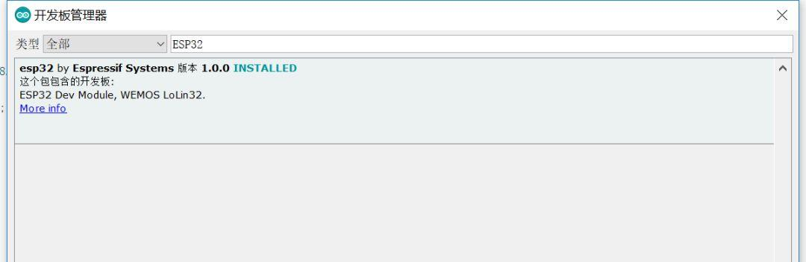
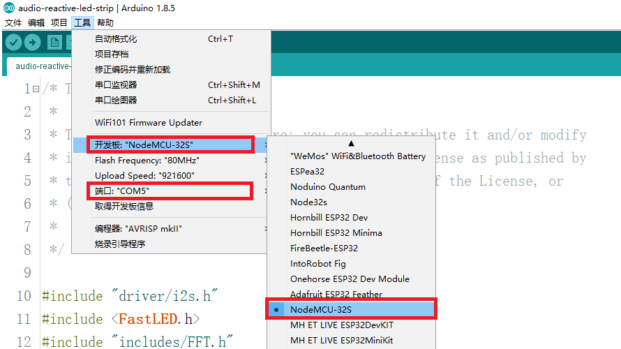
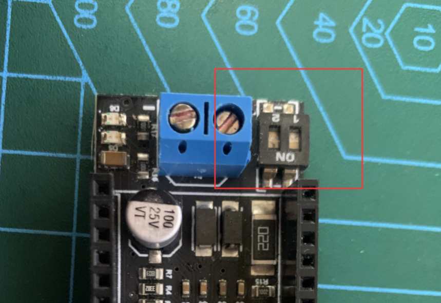

# Setup NodeMCU-32s

KNX Bridge Board can plug into the 38-pin connector on [NodeMCU-32s](https://docs.ai-thinker.com/en/esp32/boards/nodemcu_32s). Program [uart2tcp](uart2tcp.ino) should run on [NodeMCU-32s](https://docs.ai-thinker.com/en/esp32/boards/nodemcu_32s), to make the WIFI parameters configuratable, and make KNX Bridge Board can talk to WIFI.

It's done on [Arduino software platform](https://www.arduino.cc/en/software).

## Install ESP32 Board in Arduino

Add ESP32's package url in `Additional Boards Manager URLs` of the menu `Preferences`:

**`https://dl.espressif.com/dl/package_esp32_index.json`**

Open `Boards manager...` in menu `Tools`. Search `ESP32`, then install it.

## `uart2tcp.ino`

1. [Download uart2tcp.ino](https://raw.githubusercontent.com/zhujisheng/KNX-IP-Router-DIY/main/uart2tcp.ino) and open it in arduino platform.
2. Connect your computer to NodeMCU-32s by USB
3. Select the correct `Board` and `Port` in the menu `Tools`

    

4. Upload

## Config WIFI

Plug KNX Bridge Board into NodeMCU-32s, then program `uart2tcp`'s running mode will be controled by the two-position-dial-switch besides KNX bus connector on KNX Bridge Board.

Switch No.1 controls the WIFI mode. `on` means NodeMCU runs as a WIFI AP, while `off` means STA.

Switch No.2 controls the operation mode. `on` means it's time to config, `off` means config has finished and it runs in normal. 

*When you config it first time, you can run it as a WIFI **AP** in **config mode**. Then you can visit the configuration website, by connecting your computer's wifi to AP `ncn5120`(password `ncn5120tcp`), and then visit http://192.168.4.1*
